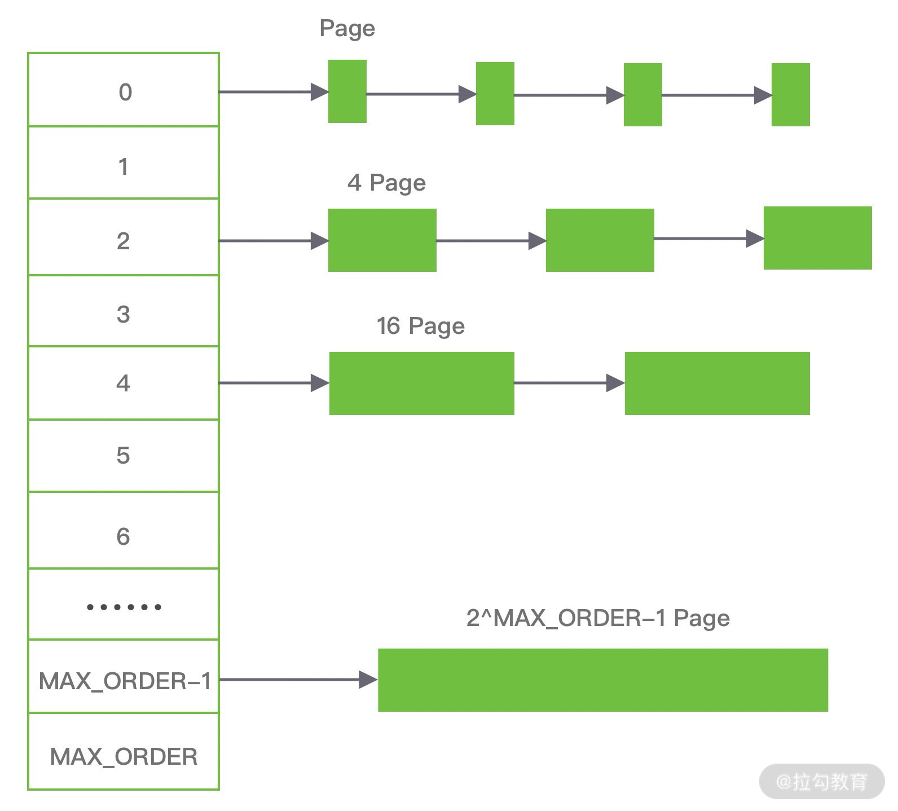

### 常见的内存分配器实现: jemalloc, ptmalloc, tcmalloc

ptmalloc: per thread malloc

> 基于glibc(`glibc是linux系统中最底层的api`)实现的, 是一个标准实现, 兼容性好
>
> 由于过于考虑性能, 多线程之间内存不共享, 各线程使用独立内存, 所以在内存开销很大.

tcmalloc: thread caching malloc

> 为每个线程分配一个局部缓存, 小对象直接有线程局部缓存来完成分派, 大对象用自旋锁减少锁竞争.

jemalloc: 

> 将内存分配粒度划分为 small,large,huge ,并记录mate数据, 空间占用略大于tcmalloc, 内存碎片少于tcmalloc

### 常用的内存分配器算法

#### 动态内存分配

Dynamic memory allocation , 又称 堆内存分配, 简称DMA

> DMA 是从一整块内存中按需分配，对于分配出的内存会记录元数据，同时还会使用空闲分区链维护空闲内存，便于在内存分配时查找可用的空闲分区

常用的三种查找策略

1. 首次适应算法 first fit

   > 每次分配都从低地址开始查找 造成低地址会不断被分配, 也会产生很多小的空闲分区

2. 循环首次适应算法 next fit

   > 在first fit 的基础上, 每次分配不从头开始查找, 而是从上次的位置开始查找
   >
   > 查找效率提升, 但是空闲分区链中的大空闲分区越来越少!

3. 最佳适应算法 best fit

   > 每次分配完把链表按照 空闲分区大小递增 的顺序保持.
   >
   > 第一个满足分配条件的空间分区就是最优解. 但是维护这个排序会损耗性能.

#### 伙伴算法

将物理内存按照2的次幂进行划分, 分配时也是按照2的次幂按需分配,  2KB, 4KB, 8KB, 16KB... 

比如请求10KB的内存就会按照16KB分配. 具体过程:

> 1. 找到存储 2^4=16 的连续 page 对应的链表, 即数组中下标为4 (拉链)
> 2. 从找到的链表中寻找空闲的内存块, 找到则分配;
> 3. 找不到, 就沿着数组向上寻找, 即从 下标为5的链表寻找空闲的page
> 4. 找到空闲的page之后,将其分为 2 个 2^4 的内存块(16Page), 其中一块分配给进程, 另一块链接到 数组中下标为4的链表.

释放内存时的过程:

> 1. 检查伙伴块是否也已释放(是否为空闲) , 如果已释放(空闲), 将两个块合成更大的块
> 2. 再 判断当前链表的内存块个数 是否 小于 阈值, 如果不小于 就会再次执行这个检查流程

> 弊: 减少了外部碎片, 增加了内部碎片(最多50%)

##### * 内存碎片

**内部碎片**: 内存按照page分配, 即使只需要很少的内存, 操作系统至少分配4K的page, 那么这个page中未使用的部分就形成了内存碎片.

**外部碎片**: 如果需要一大块内存, 操作系统会分配连续的page, 如果前边的page被回收, 就出现了外部碎片

#### Slab算法

在伙伴算法的基础上优化对小内存的分配, 解决内部碎片问题.

> 在 Slab 算法中维护着大小不同的 Slab 集合，在最顶层是 cache_chain，cache_chain 中维护着一组 kmem_cache 引用，kmem_cache 负责管理一块固定大小的对象池。通常会提前分配一块内存，然后将这块内存划分为大小相同的 slot，不会对内存块再进行合并，同时使用位图 bitmap 记录每个 slot 的使用情况。
>
> kmem_cache 中包含三个 Slab 链表：**完全分配使用 slab_full**、**部分分配使用 slab_partial** 和**完全空闲 slabs_empty**，这三个链表负责内存的分配和释放。每个链表中维护的 Slab 都是一个或多个连续 Page，每个 Slab 被分配多个对象进行存储。Slab 算法是基于对象进行内存管理的，它把相同类型的对象分为一类。当分配内存时，从 Slab 链表中划分相应的内存单元；当释放内存时，Slab 算法并不会丢弃已经分配的对象，而是将它保存在缓存中，当下次再为对象分配内存时，直接会使用最近释放的内存块。
>
> 单个 Slab 可以在不同的链表之间移动，例如当一个 Slab 被分配完，就会从 slab_partial 移动到 slabs_full，当一个 Slab 中有对象被释放后，就会从 slab_full 再次回到 slab_partial，所有对象都被释放完的话，就会从 slab_partial 移动到 slab_empty。

## jemalloc

https://kaiwu.lagou.com/course/courseInfo.htm?sid=&courseId=516&lagoufrom=noapp&sharetype=wx_friend&wxinfo=2#/detail/pc?id=4925

........